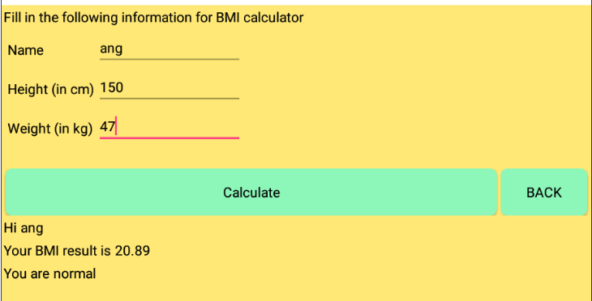

# **MyBMIUSR**
#### This is an app built by using MIT app inventor.The biggest purpose of this app is to urge current young people to become healthier people.

 
 

## Usage
Through this MyBMIUSR App, users need to install an application named <b>MIT AI2 Companion</b> inside their mobile phone in order to connect with the [MIT App Inventor 2](http://ai2.appinventor.mit.edu/) from the browser. After connecting both of them, user will be directed to the MyBMIUSR app with 5 functions provided which are <b><i>BMI calculator</i></b>, <b><i>Calo calculator</i></b>, <b><i>Chart</i></b>, <b><i>Remind</i></b>, and <b><i>Quiz</b></i>.
 

  

<li><b>BMI Calculator</b></li>
After users click BMI calculator, users need to key in their name,height(in cm) and weight(in kg) to calculate their BMI. After users key in their name,weight,and height,users have to press "<i>Calculate</i>" button so users can see their BMI result to know they are obese,overweight,normal or underweight.After users calculated their BMI, google form will received data and it will save into google sheet. Then,MyBMIUSR will display their data under Your BMI history.
 
 
<li><b>Calorie Calculator</b></li>
In this Calorie Calculator tab, users will need to key in their name, distance(in km) based on their running distance, and weight(in kg) to calculate how much their calories have burned. After keying in 3 of the fields, users have to press "<i>Calculate</i>" button in order to calculate the Calorie Burn result. The screen will show the result of calories burn and whether they're Low calories burned, Normal calories burned, or High calories burned. After getting the result, the screen will show user a button "<i>Store Data</i>" for users to save the calculated result into the database.
 
 
<li><b>Show History</b></li>
In this Show History tab, when users press on the button, they'll be directed to the History Screen which allows users to view the <b>BMI History</b>, <b>BMI Chart</b>, <b>Calorie History</b>, or <b>Calorie Chart</b> after they save their result into the database.

# ReadMe

# STEPs taken by developers when implementing the app.
  
Step 1:Define the purpose of creating the app
  
Step 2:Plan the functionality and Features of the app

Step 3:Desire the user interface for the app

Step 4:Choose a development path(For us ,we are using MIT app inventor)

Step 5:Develop the app

Step 6:Test Your app

Step 7:Launch your app

Step 8:Promote and Marketing

## Hardware /Software tools 

## Hardware
- Laptops
- handphone

## Software 
- Browsers 

## Platform 
#### Mit app inventor
