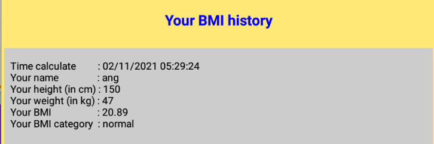
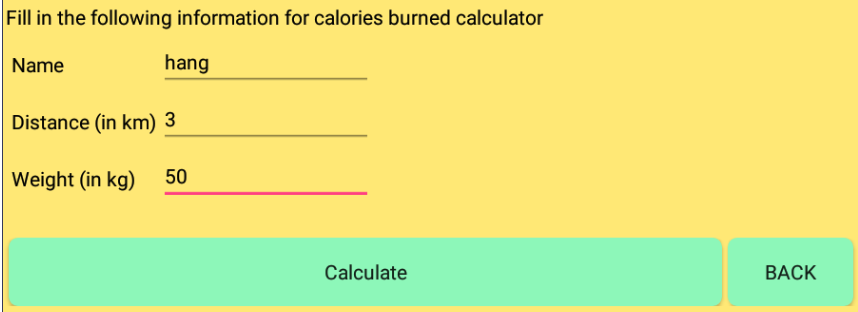
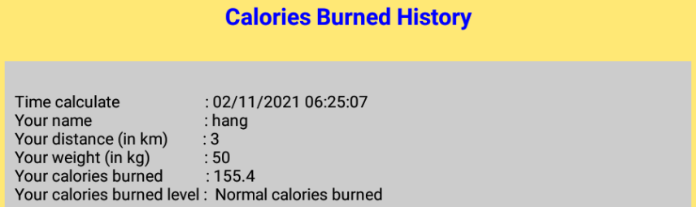
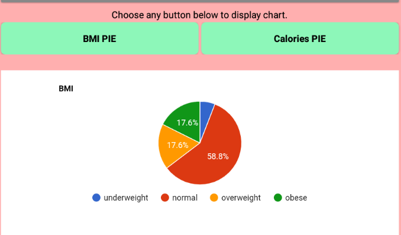
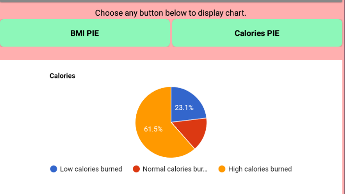
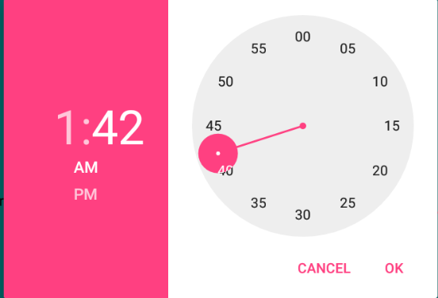
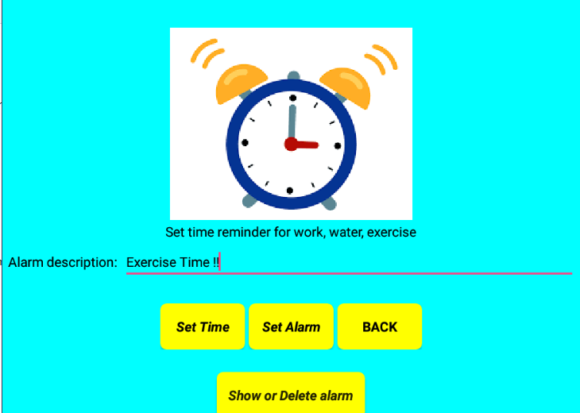
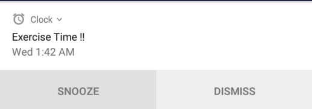
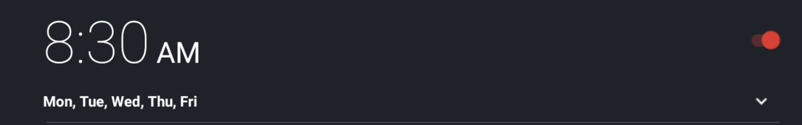
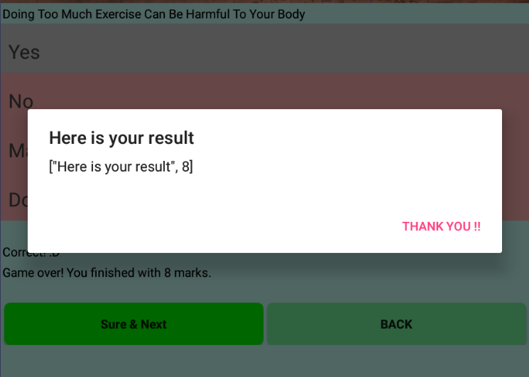

# **MyBMIUSR**
#### This is an app built by using MIT app inventor.The biggest purpose of this app is to urge current young people to become healthier people.

 
 

## Usage
Through this MyBMIUSR App, users need to install an application named <b>MIT AI2 Companion</b> inside their mobile phone in order to connect with the [MIT App Inventor 2](http://ai2.appinventor.mit.edu/) from the browser. After connecting both of them, user will be directed to the MyBMIUSR app with 5 functions provided which are <b><i>BMI calculator</i></b>, <b><i>Calo calculator</i></b>, <b><i>Chart</i></b>, <b><i>Remind</i></b>, and <b><i>Quiz</b></i>.

<li><b>BMI Calculator</b></li>
After users click BMI calculator, users need to key in their name,height(in cm) and weight(in kg) to calculate their BMI. After users key in their name,weight,and height,users have to press "<i>Calculate</i>" button so users can see their BMI result to know they are obese,overweight,normal or underweight.After users calculated their BMI, google form will received data and it will save into google sheet. Then,MyBMIUSR will display their data under Your BMI history.

  

  

 
 
<li><b>Calorie Calculator</b></li>
After users click Calo Calculator, users have to key in their name, distance(in km) based on their running distance, and weight(in kg) to calculate how much calories they burned today.After finished to key in,Press "<i>Calculate</i>"  button so users can know their calories burned results .After users calculated their calories burned results, google form will received data and it will save into google sheet. Then,MyBMIUSR will display their data under Calories Burned History.

  

  

 
 
<li><b>Chart</b></li>
In this BMI Chart or Calories Chart,it will show the BMI PIE or calories PIE after users clicked.

  

  

<li><b>Remind</b></li>
After users click Remind,users can set time to remind them what they have to do at that time,users can also type messages in Alarm descreption.After users set their time and type messages,click "<i>Set Alarm</i>.The alarm will sound at the time that set by users.Users can also delete Alarm.

  

  

  

  

  

<li><b>Quiz</b></li>
After users click the "<i>Quiz</i>" button,users have to finish 10 quiz questions.These questions are to improve user's of healthy life and let users know more about healthy life.

  

# ReadMe

# STEPs taken by developers when implementing the app.
  
Step 1:Define the purpose of creating the app
  
Step 2:Plan the functionality and Features of the app

Step 3:Desire the user interface for the app

Step 4:Choose a development path(For us ,we are using MIT app inventor)

Step 5:Develop the app

Step 6:Test Your app

Step 7:Launch your app

Step 8:Promote and Marketing

## Hardware /Software tools 

## Hardware
- Laptops
- handphone

## Software 
- Browsers 

## Platform 
#### Mit app inventor

## APIs
- MyBMIUSRYBMCKH
- MIT AI2 Companion

##License
Distributed under MIT License. See [LICENSE](https://github.com/ProjectCloudApp/TeamNameMissing/blob/34d40d8080a5f5cc5bd0b060fd79c883a7486733/LICENSE) for more information.
