## Usage manual
## Install and Connect
In mobile phone, go to Play Store and search for "MIT AI2 Companion", and download the application.
 

  

Through this MyBMIUSR App, users need to install an application named <b>MIT AI2 Companion</b> inside their mobile phone in order to connect with the [MIT App Inventor 2](http://ai2.appinventor.mit.edu/) from the browser. After connecting both of them, user will be directed to the MyBMIUSR app with 5 functions provided which are <b><i>BMI calculator</i></b>, <b><i>Calo calculator</i></b>, <b><i>Chart</i></b>, <b><i>Remind</i></b>, and <b><i>Quiz</b></i>.
 

 
<li><b>BMI Calculator</b></li>
After users click <i>"BMI calculator"</i>, users need to key in their name, height (in cm) and weight (in kg) to calculate their BMI. After users key in their name, weight, and height, users have to press "<i>Calculate</i>" button so users can see their BMI result to know they are obese, overweight, normal or underweight. After users calculated their BMI, google form will received data and it will save into google sheet. Then, MyBMIUSR will display their data under Your BMI history.
 
 

  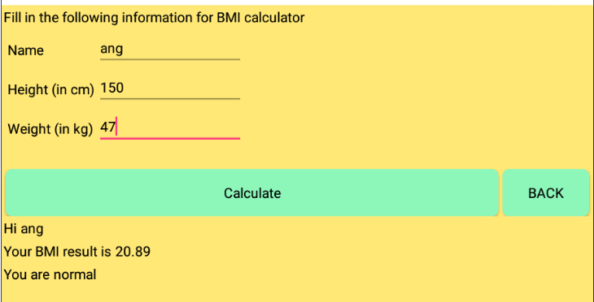

  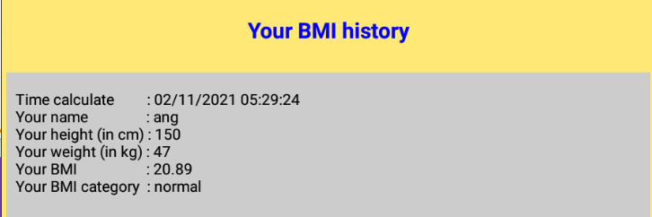

 
<li><b>Calorie Calculator</b></li>
After users click <i>"Calo Calculator"</i>, users have to key in their name, distance (in km) based on their running distance, and weight (in kg) to calculate how much calories they burned today. After finished to key in, Press "<i>Calculate</i>"  button so users can know their calories burned results .After users calculated their calories burned results, google form will received data and it will save into google sheet. Then, MyBMIUSR will display their data under Calories Burned History after reopen the screen.
 
 

  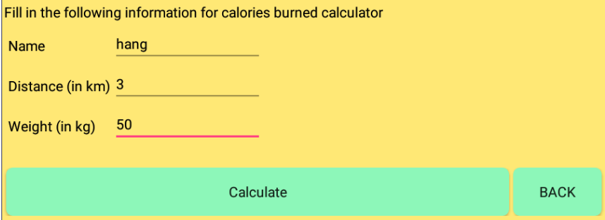

  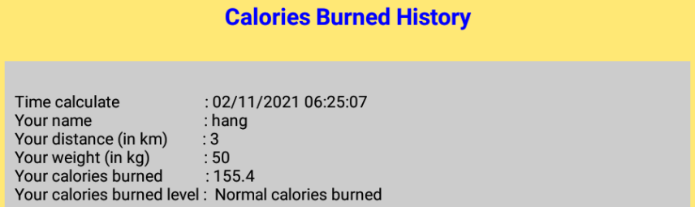

 
<li><b>Pie Chart</b></li>
The button of <i>"BMI Chart or Calories Chart"</i> will show the <i>"BMI PIE"</i> or <i>"calories PIE"</i> after users choose button clicked.
 
 

  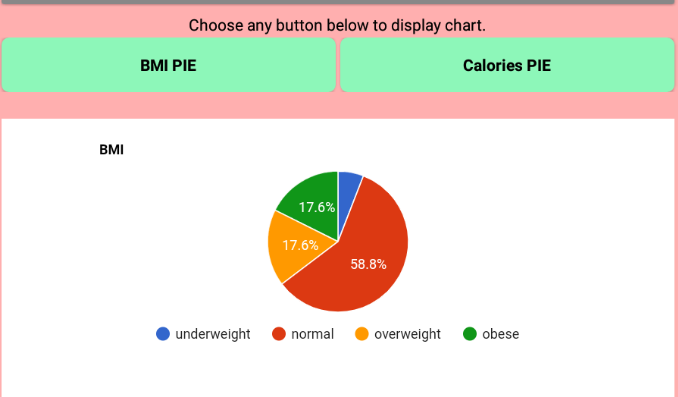

  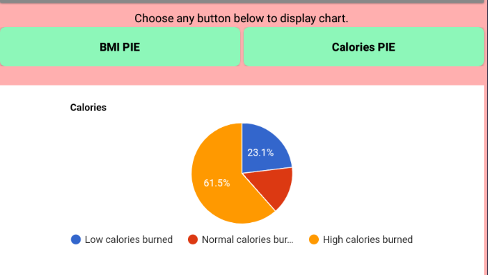

 
<li><b>Remind</b></li>
After users click <i>"Remind button"</i>, users can select or set a time by clicking the button <i>"Set Time"</i> to remind them what they have to do that time, users can also type messages in the Alarm description for users to remind themselves of the important things such as "time to exercise, work or sleep". After users set their time and type messages, click "<i>Set Alarm</i>. The alarm will sound at the time set by users. Users can also show or find the alarm their want to delete by clicking the button <i>"Show or Delete alarm"</i>.
 
 

  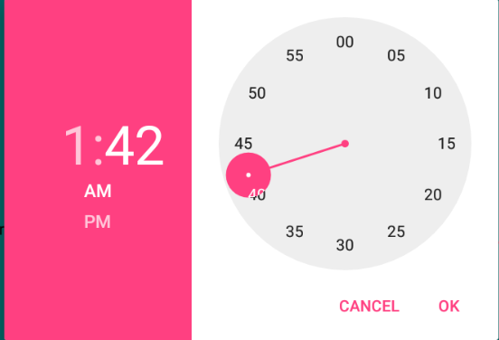

  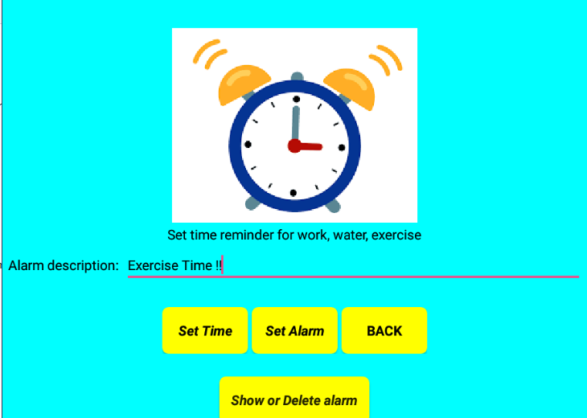

  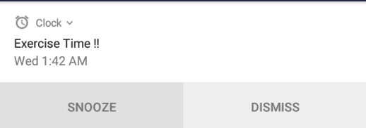

  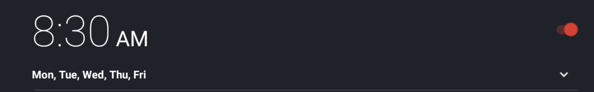

  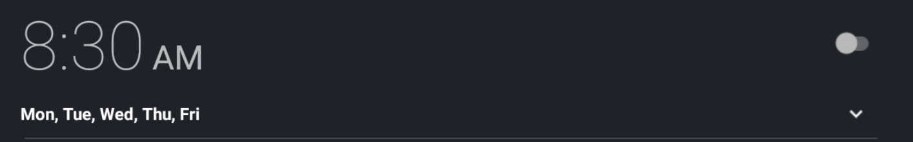

 
<li><b>Quiz</b></li>
After users click the "<i>Quiz</i>" button, users have to finish 10 quiz questions. These questions are to improve users' healthy life and let users know more about healthy living.
 
 

  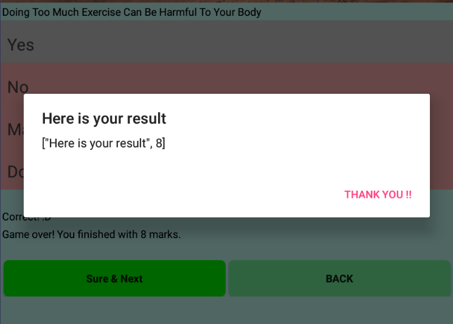

